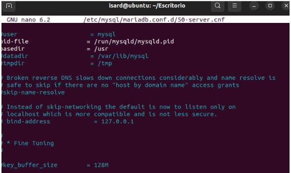

# ÍNDEX
## 0. Organització
## 1. Correcció del Codi
    1.1. db.php
    1.2. index.php
    1.3. add.php
    1.4. delete.php
    1.5. edit.php
## 2. Configuració i Instal·lació del Servidor Web amb PHP
    2.1. Configuració de l'Adaptador de Xarxa
    2.2. Instal·lació de Serveis
    2.3. Ús de la Tecnologia Git
    2.4. Configuració de l'Arxiu db.php
    2.5. Ajust de Permisos
## 3. Configuració del Servidor de Bases de Dades amb MariaDB en Debian
    3.1. Configuració de la Xarxa
        3.1.1. Afegiment d’una Interfície de Xarxa Addicional
        3.1.2. Configuració de la Interfície Estàtica
        3.1.3. Reinici del Servei de Xarxa
    3.2. Actualització del Sistema
    3.3. Instal·lació de MariaDB
        3.3.1. Accés al Monitor de MariaDB
        3.3.2. Creació de la Base de Dades
        3.3.3. Configuració del Servidor de BBDD
        3.3.4. Creació de Taules per la BBDD
        3.3.5. Creació de l’Usuari i Permisos
## 4. Arquitectura i Desplegament
    4.1 Desplegament
    4.2 Arquitectura.
   
---
# 0. Organització

Ens hem organitzat amb el proofhub. Hem dividit les tasques per a cada persona. Una persona s’encarregava de corregir el codi per desprès en una maquina de prova amb tots el serveis configurats fer el test per veure si tot anava bé. Per després compartir-lo amb el resta del equipo. 

Per una altra part, les dues persones s’encarregaven en crear en dues máquinas, el servidor web amb apache, i l’altre server amb la BBDD. Ho hem fet així, perquè considerem que evitem que algú és quedes sense fer res i evitar errors que puguin afectar completement al servidor.

Una vegada aconseguit tot i la base de dades funcionant, es feia el pull a la servidor web amb la versió final. 

# 1. Correcció codi

## 1.1 db.php
* En la primera línea, es veu que el nom del servidor està mal escrit, posa `locahost` i es `localhost`.
  

## 1.2 index.php
* **Correcció (HTML):** Hi havia dues etiquetes `<table>` niades. S'ha eliminat l'etiqueta supèrflua.

* **Correcció (HTML):** El mètode del formulari era `method="posts"`. S'ha corregit a l'estàndard `method="post"`.

* **Millora (Usabilitat):** S'ha afegit un `onclick='return confirm(...)'` a l'enllaç d' "Eliminar". Això mostra un quadre de diàleg de confirmació per evitar que els usuaris esborrin registres per accident.
* **Millora (Seguretat):** Com s'ha esmentat abans, totes les dades que venen de la base de dades (`$row['id']`, `$row['name']`, etc.) s'embolcallen amb `htmlspecialchars()` per prevenir atacs XSS.

* **Millora (Robustesa):** S'ha afegit una comprovació (`if ($result->num_rows > 0)`) per mostrar un missatge amigable ("No s'han trobat usuaris.") quan la taula està buida, en lloc de mostrar una taula sense files.
* **Codi final amb altres millores.**

## 1.3 add.php
* **Correcció (Sintaxi SQL):** La consulta preparada original era `VALUES (*, ?)`, la qual cosa és incorrecta. S'ha corregit a `VALUES (?, ?)`, fent servir un marcador de posició per cada valor a inserir.
* **Correcció (Seguretat):** S'ha implementat correctament la sentència preparada per evitar injecció SQL, vinculant les variables `$name` i `$email` amb `bind_param("ss", ...)`. El `"ss"` indica que ambdues variables són de tipus string (cadena de text).
* **Codi final amb altres millores.**

## 1.4 delete.php
* **Correcció (Sintaxis i seguretat):** La sintaxi SQL és incorrecta, `DELETE * FROM` s’ha canviat a `DELETE FROM`. A més, s'utilitza una sentència per prevenir injecció SQL.
* **Codi final amb millores i correcció.**

## 1.5 edit.php
* **Correcció (Sintaxis i seguretat):** La sintaxi de `UPDATE` és incorrecta. `where name=?` s'ha canviat per `SET name = ?`. També, s’utilitza una sentència preparada per l’actualització, prevenint l’inyecció SQL.

* **Codi final i altres millores.**

---

# Configuració instal·lació servidor web més php

## 1.1 Configuración adaptador
El primer pas és configurar l’adaptador de xarxa ASIXC2-ITB15

Una vegada comprovem que funcione i fem ping el següent pas es instalar apache y php

## 1.2 Instal·lació de serveis
**sudo apt install apache2 php libapache2-mod-php php-mysql -y**

## 1.3 Ús de la tecnologia git
Una vegada instal·lat tot el següent pas es crear els directoris corresponents
fem un mkdir -p /var/www/html/app y utilitzarem l’ordre git clone per clonar tot el repositori i utilitzarem la comanda mv per moure els arxius php dintre de la carpeta app

## 1.4 Configuració de l'arxiu db.php
Ara el que fa falta es modificar l’arxiu db.php i hem de posar el nom de la base de dades l’usuari la password i la ip de la máquina que te la BBDD

## 1.5 Ajustar permisos
Ya per últim s’han ajustat uns permisos amb les comandes
**sudo chown -R www-www-data /var/www/html/app**

**sudo chmod -R 755 /var/www/html/app**

# 3. Configuració d’un servidor de bases de dades amb MariaDB en Debian
## 3.1. Configuració de la xarxa

**3.1.1. Afegiment d’una interfície de xarxa addicional**

Des del panell d’administració d’IsardVDI, s’ha afegit una segona interfície de xarxa del tipus ASIXC2-ITB15 a la màquina virtual. Un cop afegida, s’ha verificat la disponibilitat de les dues interfícies mitjançant el comandament: ip a

**3.1.2. Configuració de la interfície estàtica**

S’ha editat el fitxer de configuració de xarxa: sudo nano /etc/network/interfaces s’hi ha inserit la configuració següent:

**3.1.3. Reinici del servei de xarxa**

Un cop guardada la configuració, s’ha reiniciat el servei de xarxa per aplicar els canvis:
sudo systemctl restart networking
S’ha verificat novament la configuració amb ip a per assegurar que la interfície enp2s0 disposa de l’adreça IP 192.168.1.2/24.

## 3.2. Actualització del sistema
Abans de procedir amb la instal·lació de paquets, s’ha actualitzat el sistema per garantir la disponibilitat de les darreres actualitzacions de seguretat i estabilitat: sudo apt update

## 3.3. Instal·lació de MariaDB
S’ha instal·lat el servidor de bases de dades MariaDB mitjançant el gestor de paquets d’APT: sudo apt install mariadb-server -y

La versió instal·lada és la 11.8.3-MariaDB, proporcionada pels repositoris oficials de Debian 13 (Trixie).

**3.3.1. Accés al monitor de MariaDB**

Un cop finalitzada la instal·lació, s’ha accedit al monitor de MariaDB com a superusuari: sudo mariadb

**3.3.2. Creació de la base de dades**

Dins de l’entorn interactiu de MariaDB, s’ha creat una base de dades amb un nom identificatiu per al projecte: CREATE DATABASE Error404_TeamNotFound;
Aquesta base de dades servirà com a repositori central per a les dades de l’aplicació associada al projecte.

**3.3. Configuración del servidor de BBDD**

El que fem és configurar mysql de tal forma que el servidor escolta totes les IPs

**3.4. Creació de taules per la BBDD**

Ara hem de crear la taula que utilitza la página web

**3.5. Creació de l’usuari i permisos**

El següent pas es crear l’usuari root per a la xarxa 192.168.1.0 i li donem permisos d’administrador

# 4.Arquitectura i Desplegament
## 4.1 Desplegament
Des del client, connectem amb Firefox al servidor web i, gràcies al PHP, podem modificar la pàgina i afegir dades com usuaris o editar-les.

## 4.2 Arquitectura
La arquitectura utilitzada és:

